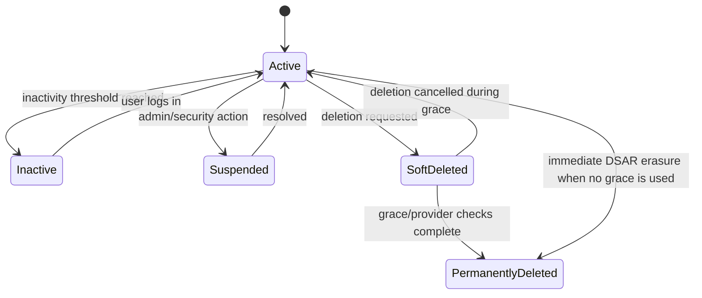

# Account and Workspace Lifecycle

Status: Data Retention and Lifecycle baseline.
Date: 2026-05-14

## Lifecycle States

| State | Meaning | Trigger | Retention impact |
| --- | --- | --- | --- |
| Active account | User can sign in and use StageLink. | Signup/login, normal operation. | Retain account, memberships, active workspaces, billing, integrations, audit logs. |
| Inactive account | No meaningful login/product activity for the inactivity threshold. | Future inactivity job. | Do not delete silently; notify and eventually archive/anonymize if no paid/legal obligations. |
| Suspended account | Account is blocked for abuse, billing, legal, or admin reasons. | Admin/security action. | Retain minimal account/workspace/audit data while investigation or billing/legal basis exists. |
| Soft-deleted account | Deletion requested/confirmed but still in grace/recovery window. | Future delayed deletion flow. | Hide account access, queue provider deletion, allow cancellation where lawful. |
| Permanently deleted account | Local account has been anonymized and eligible owned workspaces removed. | DSAR erasure completion. | Retain only DSAR/audit/legal minimums and provider/legal records. |
| Deleted provider remnant | Data remains in WorkOS/Stripe/PostHog/logs/backups due to provider/legal constraints. | Provider lifecycle after local erasure. | Track manually until provider retention/deletion is complete or documented. |

## Workspace States

| State | Meaning | Retention impact |
| --- | --- | --- |
| Draft/private | Workspace exists but public page/EPK content is not published. | Private tenant data retained while account/workspace is active. |
| Published | Public page and/or EPK is visible. | Public content can be cached externally; deletion may not remove third-party copies. |
| Shared | More than one member/owner has access. | Deleting one account removes that membership; workspace remains if another owner exists. |
| Sole-owner | One owner controls the workspace. | Account erasure can delete the workspace and cascaded tenant data. |
| Suspended | Workspace visibility/access limited due to abuse/billing/admin decision. | Retain data while dispute/legal/security basis exists. |
| Deleted | Workspace is removed locally. | Cascades local tenant data; storage/provider cleanup must be verified. |

## Plan Lifecycle States

| State | Trigger | Data behavior |
| --- | --- | --- |
| FREE | Default, expired paid subscription, downgrade. | Keep core profile/page data; premium data may become inaccessible but not immediately deleted. |
| PRO | Upgrade or downgrade from PRO+. | Keep PRO entitlement data; PRO+ features become inaccessible after downgrade grace. |
| PRO+ | Upgrade. | Premium analytics/integrations/EPK features available according to product rules. |
| Past due | Stripe status change. | Preserve data during payment retry window; restrict paid features if needed. |
| Canceled | User cancels or subscription ends. | Downgrade at period end; apply downgrade retention policy. |

## State Transitions

## Inactivity Thresholds

Proposed:

- 12 months no login/product activity: mark as inactive candidate.
- 13 months: send first inactivity notice.
- 14 months: send second notice if email is permitted/available.
- 15 months: archive or anonymize only if the account is free, has no active
  paid plan, no unresolved disputes, and no shared workspace ownership risk.

Do not silently delete:

- paid accounts;
- suspended accounts under investigation;
- accounts with unresolved DSAR/billing/legal disputes;
- owners of shared workspaces without an ownership-transfer path.

## Retention Implications

Active:

- Keep all service data needed for the product.

Inactive:

- Keep data temporarily.
- Stop non-essential notifications unless consent/lawful basis supports them.
- Do not run destructive cleanup without user notice and recovery window.

Suspended:

- Keep evidence and account data needed for abuse/legal review.
- Do not publish new public content.

Soft-deleted:

- Hide account access.
- Queue provider deletion tasks.
- Preserve recovery if grace period is chosen.

Permanently deleted:

- Anonymize local user.
- Delete sole-owner workspaces.
- Remove memberships from shared workspaces.
- Retain minimal DSAR/audit/billing records where justified.

## Open Decisions

- Whether StageLink will use a delayed deletion grace period.
- Whether inactivity deletion starts before public launch or remains manual.
- Whether inactive free accounts are archived or anonymized first.
- Whether shared workspace owner transfer is required before account deletion.

