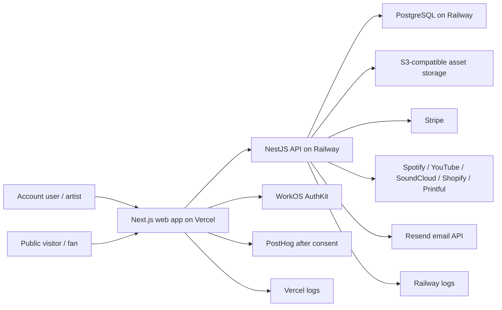
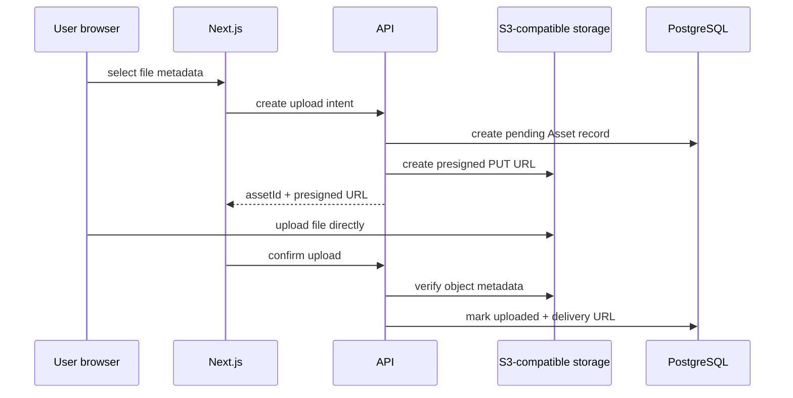

# StageLink Data Flow Mapping

Status: Privacy Plan data-mapping baseline.
Date: 2026-05-14

This document maps operational data flows that exist or are documented in the
current StageLink architecture.

## High-Level System Flow

## Flow 1: Signup, Login, and Account Provisioning

| Step | Source | Destination | Data | Storage | Processor |
| --- | --- | --- | --- | --- | --- |
| 1 | User browser | WorkOS AuthKit | email, auth method, credentials/OAuth challenge | WorkOS | WorkOS |
| 2 | WorkOS | Next.js callback | authorization code/state | transient cookies/session | WorkOS/Vercel |
| 3 | Next.js/API | StageLink API | verified identity/session token | encrypted session cookie, API request | Vercel/Railway |
| 4 | API | PostgreSQL | user row with WorkOS ID, email, names, avatar | `users` | Railway DB |
| 5 | API | Audit/logs | security/account events where implemented | `audit_logs`, provider logs | Railway/Vercel |

Privacy notes:

- Auth cookies are necessary and must not be blocked by consent preferences.
- WorkOS is the authoritative identity provider; StageLink stores only the
  local identity link and app account metadata.
- Radar/bot/brute-force decisions are security metadata.

## Flow 2: Onboarding and Artist Workspace Creation

| Step | Source | Destination | Data | Storage |
| --- | --- | --- | --- | --- |
| 1 | Authenticated user | Web onboarding | artist name, username, category, optional image choices | browser form state |
| 2 | Web | API | onboarding payload | request body |
| 3 | API | PostgreSQL | artist, page, membership, default subscription/page data | `artists`, `artist_memberships`, `pages`, `subscriptions` |
| 4 | API | Audit logs | workspace creation/action metadata | `audit_logs` where implemented |

Privacy notes:

- Workspace data is tenant-root data.
- Onboarding data may become public after publication.
- Username is public/discoverable.

## Flow 3: Profile, Public Page, and Block Editing

| Step | Source | Destination | Data | Storage |
| --- | --- | --- | --- | --- |
| 1 | Authenticated user | Web dashboard | profile/page/block form input | browser state |
| 2 | Web API proxy | API | profile/page/block payload | request body |
| 3 | API | PostgreSQL | artist profile, page settings, block config/localized content | `artists`, `pages`, `blocks` |
| 4 | Public visitor | Web/API public routes | username/page request | server-render/public API response |
| 5 | Web/API | Browser/CDN/search/social previews | published content | public cache/index risk |

Privacy notes:

- Publication status controls exposure.
- Block config can contain URLs, contact details, copy, consent labels, merch
  product handles, and form settings.
- Public caches and search indexing are external persistence points.

## Flow 4: EPK Creation and Publication

| Step | Source | Destination | Data | Storage |
| --- | --- | --- | --- | --- |
| 1 | Artist/editor | EPK editor | bios, contacts, rider, tech requirements, location, media, links | browser state |
| 2 | Web/API | API | EPK payload | request body |
| 3 | API | PostgreSQL | EPK draft/published data | `epks` |
| 4 | Public visitor/promoter | Public EPK route | published EPK content | browser/CDN/external sharing |

Privacy notes:

- EPK fields are sensitive-by-context even when business-oriented.
- Publishing an EPK can expose contact, location, and operational details to
  public visitors.

## Flow 5: Uploads and Asset Delivery

Privacy notes:

- Browser never receives raw storage credentials.
- Original filenames and object keys are metadata with privacy value.
- Object deletion must be verified as part of erasure and asset lifecycle work.

## Flow 6: Public Fan Email Capture

| Step | Source | Destination | Data | Storage |
| --- | --- | --- | --- | --- |
| 1 | Fan/visitor | Public page email block | email, consent checkbox, locale/path, honeypot | browser form |
| 2 | Web/API | API public subscriber endpoint | email, consent, block ID, headers | request body/headers |
| 3 | API | PostgreSQL | subscriber record with consent snapshot and IP hash | `subscribers` |
| 4 | API | Analytics/PostHog | fan capture event only if tracking consent flag allows | `analytics_events`, PostHog |

Privacy notes:

- Artist ID is derived server-side from the block, not trusted from the client.
- Email is direct fan personal data.
- Current subscriber DSAR/unsubscribe ownership model needs operational finality.

## Flow 7: Public Analytics and Smart Links

| Step | Source | Destination | Data | Storage |
| --- | --- | --- | --- | --- |
| 1 | Visitor browser | Public page/SmartLink route | request path, user-agent, IP-derived metadata | runtime request |
| 2 | Consent manager | Web/API | `sl_ac` consent signal | cookie/header |
| 3 | API | PostgreSQL | event type, artist/block/link IDs, IP hash, country/device, quality flags | `analytics_events` |
| 4 | Web/API | PostHog | product/event properties after analytics consent | PostHog |

Privacy notes:

- Non-essential analytics must remain blocked until consent.
- Server-side public analytics should respect forwarded consent signals.
- Raw analytics retention automation is still missing.

## Flow 8: Billing and Stripe Webhooks

| Step | Source | Destination | Data | Storage |
| --- | --- | --- | --- | --- |
| 1 | User | Web billing settings | selected plan, return URL | browser/API request |
| 2 | API | Stripe Checkout/Portal | customer, artist ID, plan, metadata | Stripe |
| 3 | Stripe | Webhook endpoint | signed event payload | transient request |
| 4 | API | PostgreSQL | subscription state, Stripe IDs, processed event IDs | `subscriptions`, `stripe_webhook_events` |

Privacy notes:

- Stripe stores payment instruments; StageLink stores metadata/IDs.
- Webhook event IDs are retained for idempotency/replay protection.
- Stripe retention is governed by payment/legal obligations.

## Flow 9: Platform Insights Integrations

| Step | Source | Destination | Data | Storage |
| --- | --- | --- | --- | --- |
| 1 | Artist | Settings UI | provider reference, handle, URL, or OAuth result | browser/API request |
| 2 | API | Provider API | reference/OAuth token/scopes | provider systems |
| 3 | Provider API | API | profile/metrics/top content | transient response |
| 4 | API | PostgreSQL | connection metadata, token fields, snapshots | insights connection/snapshot tables |
| 5 | API scheduler | Provider APIs | periodic sync requests | provider/API logs |

Privacy notes:

- Tokens are critical secrets.
- Snapshot JSON may contain provider-specific identifiers and metrics.
- Disconnect/revocation must remove local tokens and stop sync.

## Flow 10: Shopify and Merch Providers

| Step | Source | Destination | Data | Storage |
| --- | --- | --- | --- | --- |
| 1 | Artist | Settings UI | store domain, storefront token, API token, handles | browser/API request |
| 2 | API | Shopify/Printful/Printify | token/reference validation, product requests | provider systems |
| 3 | API | PostgreSQL | connection config and provider identifiers | integration tables |
| 4 | Public page | API/provider | selected product display data | public page response |

Privacy notes:

- Storefront/API tokens are secrets and must be redacted.
- Public merch blocks may expose store/business data.

## Flow 11: DSAR and Account Deletion

| Step | Source | Destination | Data | Storage |
| --- | --- | --- | --- | --- |
| 1 | Authenticated user | Privacy settings | export/update/delete request | browser/API request |
| 2 | API | PostgreSQL | DSAR request row | `dsar_requests` |
| 3 | API | PostgreSQL | export query or anonymization/delete transaction | app tables |
| 4 | API | Audit logs | privacy action metadata | `audit_logs` |
| 5 | User | Browser | JSON export or deletion result | local download/response |

Privacy notes:

- Exports redact tokens/secrets.
- External provider deletion is currently manual.
- Deletion uses local anonymization plus workspace deletion/removal logic.

## Flow 12: Landing Contact and Support

| Step | Source | Destination | Data | Storage |
| --- | --- | --- | --- | --- |
| 1 | Visitor | Contact form | name, email, artist type, message, timing/honeypot | browser request |
| 2 | Web route | Resend | message payload and reply-to email | Resend/email inbox |
| 3 | Web route | Logs | errors only; should not log message body | Vercel logs |

Privacy notes:

- Free-text messages can contain unexpected sensitive data.
- Email-provider retention and support-inbox retention need final policy.

## Tenant Isolation Overview

Tenant boundary: `Artist`.

Controls observed:

- `ArtistMembership` is the source of truth for user access to artist
  workspaces.
- API services use membership checks for write/read flows such as assets and
  insights.
- Public endpoints derive `artistId` from server-side block/page/smart-link
  ownership rather than trusting client-submitted tenant IDs.
- DSAR export loads artists where the user is a member.
- Deletion deletes sole-owner workspaces or removes membership from shared
  workspaces.

Remaining governance requirement:

- Every new endpoint must document whether it is account-scoped,
  artist-scoped, public, or admin-only, and the membership/access check it uses.
