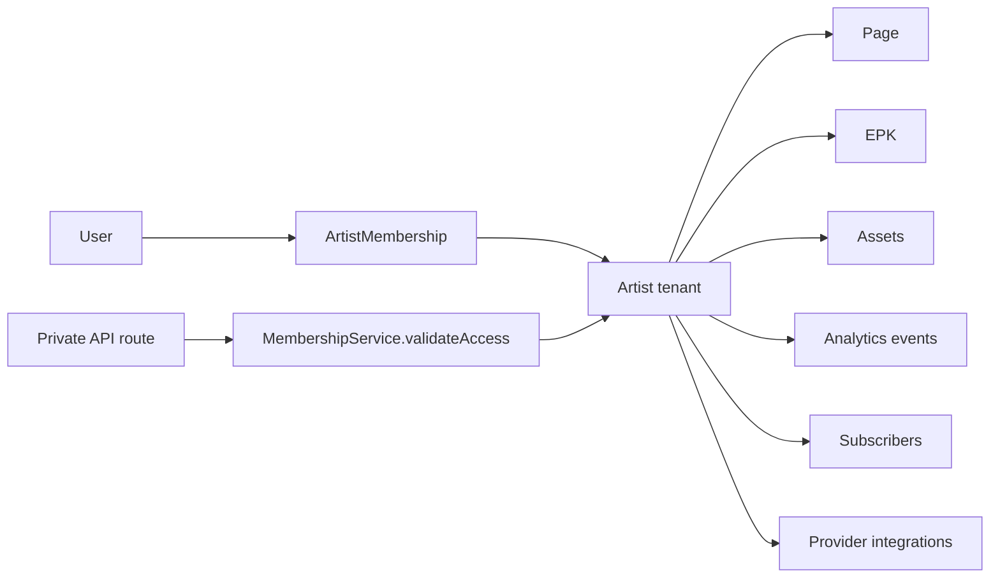

# Multi-Tenant Isolation Privacy Review

Status: Privacy-by-Design baseline.
Date: 2026-05-14

## Tenant Boundary

StageLink's practical tenant boundary is the `Artist` workspace.

The local `User` account can belong to one or more artist workspaces through
`ArtistMembership`. Access is determined by membership role, not by trusting a
client-supplied `artistId`.

## Current Authorization Model

Observed role model:

| Role | Intended access |
| --- | --- |
| `viewer` | Read workspace data. |
| `editor` | Edit content/profile/page data where write access is accepted. |
| `admin` | Administer workspace features except ownership-only actions. |
| `owner` | Highest workspace control. |

Observed service pattern:

- `MembershipService.validateAccess(userId, artistId, required)` maps roles to
  read/write/admin/owner levels.
- Missing membership returns `404` rather than `403`, reducing resource
  enumeration risk.
- `getArtistIdsForUser()` scopes dashboard listing to the authenticated user's
  memberships.
- Resource parent resolution exists for artist, page, block, and smart link.

## Current Strengths

- Workspace access is centralized in `MembershipService`.
- Artist listing uses membership scope rather than global user ownership only.
- Assets validate membership before upload intent, confirm, and list.
- Insights, analytics, EPK, page, block, merch, and Shopify routes have recent
  security-audit coverage.
- Public subscriber flows derive artist ownership from server-side block/page
  relationships.
- DSAR export is user-scoped and redacts secrets.
- Account deletion removes sole-owner workspaces and removes membership from
  shared workspaces.

## Privacy Risks

### Cross-tenant query drift

Risk:

- Future endpoints can accidentally query by raw `artistId`, `blockId`, or
  `pageId` without using membership validation.

Control:

- Every private endpoint must perform one of:
  - direct `validateAccess(user.id, artistId, required)`;
  - parent resource resolution followed by `validateAccess`;
  - Behind owner/admin guard for internal-only admin routes.

### Public/private boundary confusion

Risk:

- EPK, page blocks, gallery images, contact emails, and social links may be
  private in draft state but public after publish.

Control:

- Public route DTOs should expose only fields needed to render published pages.
- Dashboard APIs can expose private draft fields only after membership checks.

### Shared workspace deletion

Risk:

- A user deleting their account may expect all artist content to disappear, but
  shared workspaces can remain if another owner exists.

Control:

- Keep this behavior disclosed in deletion policy and DSAR UI.
- Add owner-transfer and workspace deletion confirmation flows if shared teams
  become common.

### Database-level RLS

Risk:

- Prisma/Railway PostgreSQL currently relies on application-level access
  checks. There is no evidence of PostgreSQL RLS policies enforcing tenant
  isolation below the API layer.

Control:

- Application-level checks are acceptable for current architecture, but RLS or
  database views should be reconsidered when direct database access, internal
  BI, or third-party reporting tools are introduced.

## Required Checklist for New Private Endpoints

Before merge, confirm:

- The route requires an authenticated WorkOS session or backend JWT.
- The route resolves a tenant boundary.
- The route performs a membership/role check.
- The route avoids returning records from other artists.
- The route does not leak whether another tenant's resource exists.
- The route has tests for forbidden cross-tenant access.
- The route is included in DSAR/export/deletion if it stores personal data.

## Isolation Diagram

## Launch Readiness

Readiness: strong for private QA and controlled beta.

Before broad public launch:

- Add a short "authorization checklist" to PR review or security docs.
- Add integration tests for each new endpoint class that touches tenant data.
- Evaluate RLS only if the database starts being accessed outside the API.

