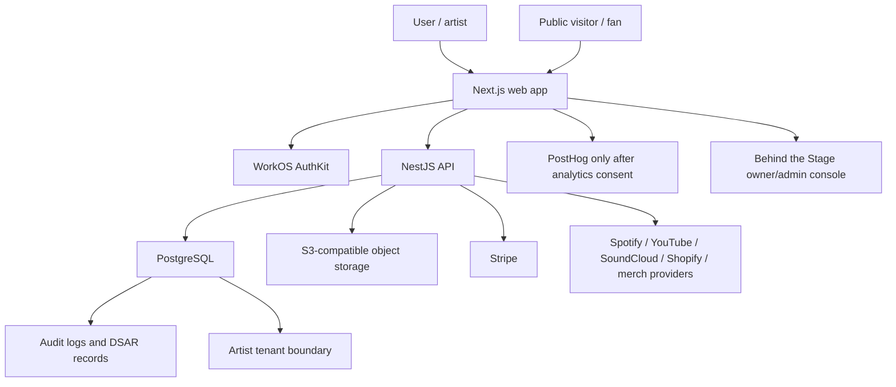

# StageLink Privacy by Design

Status: Privacy Plan baseline.
Date: 2026-05-14
Scope: privacy architecture review for the current StageLink application,
including Next.js web, NestJS API, PostgreSQL, WorkOS, Stripe, analytics,
uploads, integrations, and Behind the Stage admin tooling.

This document turns the previous legal, consent, DSAR, and data-mapping work
into engineering principles that should guide every production change.

## Privacy Principles

StageLink should treat privacy as a product constraint, not as a later legal
wrapper.

| Principle | StageLink interpretation | Current posture |
| --- | --- | --- |
| Data minimization | Collect only the account, artist, billing, analytics, and integration data needed to run the service. | Partially implemented; several optional/profile fields are user-controlled, but retention and provider minimization need follow-up. |
| Privacy by default | Private dashboard data stays private; public pages/EPKs become public only by user action. | Mostly implemented through publish flags and authenticated dashboard routes. |
| Tenant isolation | The artist workspace is the tenant boundary; users access artist data through memberships and roles. | Strong API pattern exists through `ArtistMembership` and `MembershipService`. |
| Least privilege | Internal/admin access should be narrower than product-user access and should be auditable. | Behind has owner/admin split, but admin audit coverage is still incomplete. |
| Confidentiality | Secrets, tokens, access tokens, and private data must not leak through browser bundles, exports, logs, or public APIs. | Improved; API tokens are encrypted/redacted in key paths. Provider token lifecycle needs continued review. |
| Accountability | Sensitive actions should create privacy-safe audit trails. | Implemented for several modules, DSAR, subscribers, assets, artists, and Behind role changes. Coverage is not yet complete. |
| Storage limitation | Data should have a defined retention and deletion path. | Documented, but automated retention jobs remain a launch-readiness gap. |

## Current Data Collection Audit

### Required data

These categories are necessary for StageLink to operate:

- WorkOS account identity: email, WorkOS ID, session state, security metadata.
- Local user record: local ID, email, name fields, avatar URL, suspension/deletion flags.
- Artist workspace: username, display name, category, membership role.
- Public page/EPK content explicitly entered by the artist.
- Billing metadata: Stripe customer/subscription IDs and plan state.
- Security/audit metadata: actor, action, entity, timestamp, request context.
- Upload metadata: asset kind, MIME type, size, object key, delivery URL.

### Optional data

These should remain optional unless a feature specifically requires them:

- Artist bio, full bio, tags, record labels, social links, streaming links.
- Contact email, booking email, management/press contacts.
- Gallery images, cover image, EPK rider/technical requirements.
- Shopify, merch, Spotify, YouTube, SoundCloud references or tokens.
- Fan/subscriber email capture blocks.
- Non-essential analytics consent.

### Risky or high-review data

These are allowed only with clear purpose and stronger controls:

- OAuth/API tokens for Shopify, merch providers, and future platform OAuth.
- EPK contact/rider/location/availability information.
- Fan/subscriber emails and consent snapshots.
- Raw provider analytics snapshots and external account identifiers.
- Admin/Behind user search and account-management data.
- Runtime logs that may contain request metadata or operational errors.

## Minimization Strategy

### Account creation

Minimum required local data:

- `users.id`
- `users.workos_id`
- `users.email`
- `users.is_suspended`
- timestamps

Optional local data:

- first name
- last name
- avatar URL

Do not store:

- WorkOS passwords or password hashes
- raw OAuth profile payloads beyond fields needed for the product
- WorkOS access tokens in PostgreSQL

### Artist profile

Minimum required workspace data:

- `artists.id`
- `artists.user_id`
- `artists.username`
- `artists.display_name`
- `artists.category`
- `artist_memberships.artist_id`
- `artist_memberships.user_id`
- `artist_memberships.role`

Optional/public-at-user-direction data:

- bio/full bio, images, social links, streaming links, labels, tags,
  translations, contact email, EPK fields, block content.

Privacy default:

- New content should be private/draft by default unless the existing feature
  intentionally publishes it.
- Publishing should be explicit and reversible.

### Analytics

Current positive controls:

- Consent manager blocks browser PostHog until analytics consent.
- PostHog browser client disables IP capture, autocapture, and automatic
  pageviews.
- Public analytics events store IP hashes rather than raw IP.
- QA/bot/environment flags allow dashboard filtering.

Required minimization rule:

- Do not add raw IP, exact user agent, full URL query strings, email, phone,
  access token, provider token, or free-text content to analytics events.
- Add a short event catalog entry before adding any new analytics event.

Open question:

- First-party aggregate public analytics currently remain legitimate-interest
  product metrics. Confirm this posture with final legal review before broad
  public launch.

### Third-party integrations

Provider data should use a "reference-first" approach:

- Prefer public profile URLs, handles, product handles, and provider IDs over
  OAuth/API tokens.
- Store tokens only when a feature cannot work without them.
- Encrypt stored third-party tokens.
- Redact tokens in exports, logs, admin responses, and UI payloads.
- Provide disconnect/delete semantics before making a provider feature public.

## Privacy Defaults for New Features

Every new feature should answer these questions before merge:

1. What personal data is collected?
2. Is every field required, optional, generated, or imported?
3. Which user or tenant owns the data?
4. Is it public, private, internal, or provider-controlled?
5. Which backend check enforces access?
6. Is the data included in DSAR export/deletion?
7. Is retention defined?
8. Are logs and analytics safe?
9. Does a third-party processor receive it?
10. Does the privacy documentation need an update?

## Architecture Summary

## Privacy Risk Analysis

### Critical

None found in this documentation scope.

### High

| Risk | Why it matters | Required control |
| --- | --- | --- |
| Retention is documented but not automated | Data may live longer than disclosed. | Implement retention/anonymization jobs for analytics, logs, snapshots, failed uploads, and stale pending assets. |
| Provider-side deletion/revocation is manual | Local DSAR erasure may not remove WorkOS, Stripe, PostHog, storage, email, or provider remnants. | Add operational runbook and later automation. |
| Admin/Behind access can view broad account data | Internal access is high privacy impact. | Add complete audit trails for admin views and sensitive actions. |
| Third-party tokens require lifecycle proof | Token leakage or stale tokens create account takeover/provider access risk. | Keep token encryption, add rotation/disconnect validation, and audit provider token responses. |

### Medium

| Risk | Why it matters | Required control |
| --- | --- | --- |
| Consent history is browser-local | Historical consent evidence is limited. | Add server-side consent events if regulator-grade history is needed. |
| Public page/EPK external caching | Deletion from StageLink may not remove external copies. | Disclose clearly and provide unpublish/delete controls. |
| Free-text contact/support fields | Users can include sensitive data unexpectedly. | Avoid logging body content and define inbox retention. |
| Analytics lawful basis requires final review | Aggregate analytics may still be contested in some jurisdictions. | Confirm with counsel and keep non-essential tracking consent-gated. |
| Asset object deletion is not proven end-to-end | DB deletion may not remove object storage. | Add object deletion/orphan cleanup test. |

### Low

| Risk | Why it matters | Required control |
| --- | --- | --- |
| Spanish privacy translations are not final | LatAm users may need clearer transparency. | Translate after English legal copy is final. |
| Documentation maintenance can drift | Privacy docs lose value if not updated. | Add privacy checklist to feature PRs. |

## Operational Recommendations

Before broad public launch:

- Implement retention cleanup jobs.
- Add provider-side deletion/revocation runbook.
- Add admin access audit events for Behind user search, user detail views, role
  changes, invitations, deletion/suspension, and debug-header access.
- Verify object storage deletion with disposable test uploads.
- Confirm provider DPAs, regions, subprocessors, and log retention.
- Decide whether first-party aggregate analytics should stay legitimate
  interest or become fully consent-dependent in stricter regions.

Future improvements:

- Server-side consent event ledger.
- Automated provider deletion jobs.
- Field-level encryption for stored provider tokens if risk grows.
- Privacy monitoring dashboard in Behind.
- Data lineage tests for DSAR export completeness.
- Scheduled stale/pending upload cleanup.

