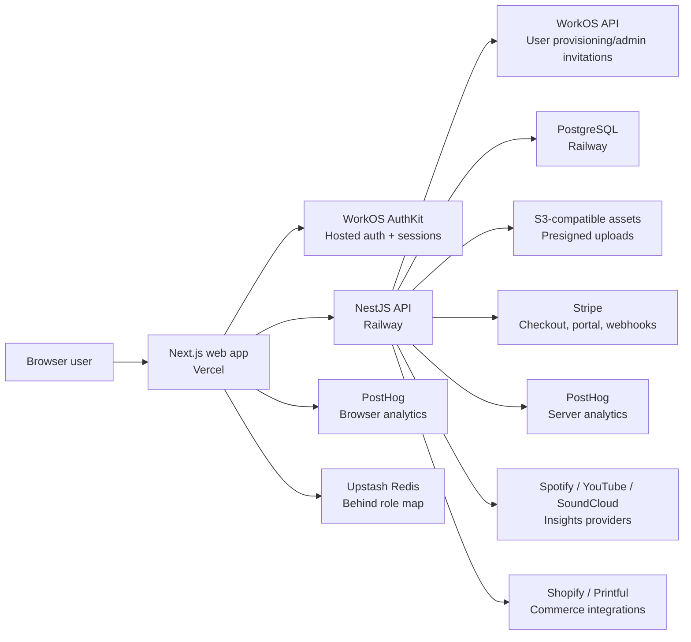

# StageLink — Security Audit E1: Setup & Discovery

Status: completed as discovery baseline
Last checked: 2026-05-07

## Goal

Close the first Security Audit stage:

- T1.1 — repo and real stack inspection;
- T1.2 — architecture mapping;
- T1.3 — critical-flow identification;
- T1.4 — dependency and external-service inventory.

This stage does not attempt to fix security issues. It establishes the evidence
map that later Security Audit tasks will use.

## T1.1 — Repo And Real Stack Inspection

StageLink is a pnpm monorepo:

| Area           | Path                                          | Stack                                                                                                   |
| -------------- | --------------------------------------------- | ------------------------------------------------------------------------------------------------------- |
| Web app        | `apps/web`                                    | Next.js 15, React 19, WorkOS AuthKit Next.js, next-intl, PostHog client, Upstash Redis for Behind roles |
| API            | `apps/api`                                    | NestJS 11, Prisma 5, PostgreSQL, WorkOS Node SDK, Stripe, AWS SDK/S3-compatible storage, PostHog Node   |
| Shared types   | `packages/types`                              | TypeScript shared contracts and billing/entitlement helpers                                             |
| UI package     | `packages/ui`                                 | Shared UI package                                                                                       |
| Config package | `packages/config`                             | Shared config support                                                                                   |
| E2E            | `e2e`                                         | Playwright                                                                                              |
| Infra          | `infra/docker`, `railway.json`, `vercel.json` | Local Postgres/MinIO, Railway API deploy, Vercel web deploy                                             |
| QA tooling     | `scripts/data`, `scripts/performance`         | Data validation, row counts, backup/restore dry-runs, load/stress runners                               |

Primary production split:

- `stagelink.art` is the canonical public/product web domain on Vercel.
- `behind.stagelink.art` is the internal Behind the Stage dashboard, served by
  the same Vercel app with host-based rewrites.
- The NestJS API is deployed on Railway.
- Railway currently exposes only the `production` environment for the linked
  project.

Current CI:

- `.github/workflows/ci.yml` runs typecheck, API unit tests, web unit tests, API
  integration tests, build, staging E2E and production smoke.
- E2E and smoke are skipped for docs-only changes.
- Staging E2E depends on WorkOS credentials and can be affected by WorkOS Radar
  challenge policy.

## T1.2 — Architecture Map

### Web Security Boundary

The web app owns:

- WorkOS session cookie handling through AuthKit middleware;
- localized marketing/auth/app routes;
- public artist/EPK SSR pages;
- public SmartLink redirects through `/go/:id`;
- Behind the Stage admin UI and `/api/admin/*` route handlers;
- limited in-memory web rate limiting for SmartLink redirect handling;
- PostHog browser analytics when configured.

Important files:

- `apps/web/src/middleware.ts`
- `apps/web/src/lib/auth.ts`
- `apps/web/src/lib/admin-guard.ts`
- `apps/web/src/lib/behind-config.ts`
- `apps/web/src/lib/behind-redis.ts`
- `apps/web/next.config.ts`
- `apps/web/vercel.json`

### API Security Boundary

The API owns:

- JWT validation against WorkOS JWKS;
- internal user provisioning from WorkOS user IDs;
- resource ownership checks via artist memberships;
- artist/profile/page/block/EPK/asset/SmartLink/subscriber/billing/insights
  mutation APIs;
- public page, public EPK, public subscriber, public analytics and public
  SmartLink endpoints;
- Stripe webhook verification and subscription projection;
- S3 presigned upload URL generation and upload confirmation;
- encrypted storage for provider tokens through `SECRETS_ENCRYPTION_KEY`;
- audit logging for sensitive operations.

Important files:

- `apps/api/src/app.module.ts`
- `apps/api/src/main.ts`
- `apps/api/src/common/guards/index.ts`
- `apps/api/src/common/decorators/index.ts`
- `apps/api/src/modules/membership/membership.service.ts`
- `apps/api/src/modules/admin/*`
- `apps/api/src/modules/assets/*`
- `apps/api/src/modules/billing/*`
- `apps/api/prisma/schema.prisma`

### Auth And Authorization Model

Auth:

- WorkOS AuthKit manages hosted login/signup and session cookies in Next.js.
- The frontend forwards WorkOS access tokens to the API.
- The API validates Bearer tokens with WorkOS JWKS.
- `JwtAuthGuard` is registered as a global Nest `APP_GUARD`.
- API routes marked `@Public()` opt out of JWT validation.

Authorization:

- StageLink is artist-tenant scoped.
- `ArtistMembership` is the source of truth for role-based access:
  `viewer`, `editor`, `admin`, `owner`.
- `OwnershipGuard` resolves the artist tenant from `artist`, `page`, `block` or
  `smartLink` route params and validates the required access level.
- Missing membership returns `404` for tenant resources to reduce enumeration.

Behind/admin:

- Web `/api/admin/*` route handlers use WorkOS session plus Behind role checks.
- Behind roles come from immutable env-var owner emails plus Redis roles.
- Nest `/api/admin/*` endpoints are protected by global JWT validation and
  `AdminOwnerGuard`.
- Current Nest owner guard uses a hardcoded owner email and should be reviewed
  during E2 authorization/admin audit.

## T1.3 — Critical Flows

| Flow                                  | Entry points                                                                                                 | Assets / data touched                                              | Security controls to audit later                                                                                         |
| ------------------------------------- | ------------------------------------------------------------------------------------------------------------ | ------------------------------------------------------------------ | ------------------------------------------------------------------------------------------------------------------------ |
| Signup/login/session                  | WorkOS hosted auth, `apps/web/src/app/api/auth/*`, `GET /api/auth/me`                                        | WorkOS users, StageLink `users`, session cookies, access tokens    | Redirect allowlist, Radar policy, session lifetime, callback behavior, token validation, suspended/deleted user behavior |
| Onboarding/profile creation           | `/api/onboarding/complete`, `artists`, `pages`, memberships                                                  | `users`, `artists`, `artist_memberships`, `pages`                  | Username validation, reserved names, ownership assignment, tenant bootstrap                                              |
| Dashboard artist/profile/page editing | `artists`, `pages`, `blocks`, `epk`, `shopify`, `merch`, `insights` controllers                              | Artist profile, EPK, blocks, provider tokens, insights connections | OwnershipGuard coverage, role levels, validation DTOs, encrypted provider credentials                                    |
| Public artist/EPK discovery           | `GET /api/public/pages/by-username/:username`, `GET /api/public/epk/by-username/:username`, public SSR pages | Published public profile/EPK content, analytics events             | Public data minimization, XSS rendering, SSR cache isolation, rate limits                                                |
| Upload content/assets                 | `POST /api/assets/upload-intent`, browser PUT to S3, `POST /api/assets/:id/confirm`                          | S3 objects, `assets`, artist avatar/cover/gallery refs             | MIME/size validation, ownership, presigned URL TTL, object-key control, asset delivery exposure                          |
| Fan capture/contact                   | Public block subscriber endpoint, web contact route                                                          | Subscriber emails, artist relationship, email delivery             | Rate limiting, validation, duplicate handling, email injection/spam controls                                             |
| SmartLinks                            | Authenticated SmartLink CRUD, public `/go/:id`, public resolve endpoint                                      | SmartLink destinations, redirect analytics                         | URL validation, open redirect policy, public rate limiting, analytics quality flags                                      |
| Billing                               | Stripe checkout/portal, `POST /api/billing/webhook`                                                          | Stripe customers/subscriptions, entitlements, webhook events       | Webhook signature, idempotency, stale-event ordering, return URL validation                                              |
| Behind the Stage admin                | `behind.stagelink.art`, web `/api/admin/*`, Nest `/api/admin/*`                                              | User list, status, soft-delete, invitations, role map              | Owner/admin roles, host routing, API double enforcement, auditability, role storage                                      |
| Insights/commerce integrations        | Spotify/YouTube/SoundCloud, Shopify, Printful                                                                | Provider tokens, selected products, insights snapshots             | Secret encryption, provider input validation, external API error handling                                                |

## T1.4 — Dependencies And External Services

### Runtime Dependencies

API:

- NestJS core/platform/config/schedule;
- Prisma and PostgreSQL;
- WorkOS Node SDK and `jose` for JWT verification;
- Stripe;
- AWS SDK S3 and presigner;
- PostHog Node;
- class-validator/class-transformer/Joi.

Web:

- Next.js, React, next-intl;
- WorkOS AuthKit Next.js;
- Upstash Redis;
- PostHog browser SDK;
- Radix UI, lucide-react, React Hook Form, Zod.

Testing/tooling:

- Jest and Supertest for API tests;
- Vitest and Testing Library for web tests;
- Playwright for E2E;
- Prettier, TypeScript and ESLint.

### External Services

| Service                    | Use                                                                                        | Secret/config class                                               | Audit focus                                                                    |
| -------------------------- | ------------------------------------------------------------------------------------------ | ----------------------------------------------------------------- | ------------------------------------------------------------------------------ |
| WorkOS/AuthKit/Radar       | Auth, sessions, hosted login, first-login user provisioning, invitations, abuse challenges | `WORKOS_*`, `WORKOS_COOKIE_PASSWORD`, redirect URIs, Radar policy | Auth/session audit, Radar/CI allowlist, MFA posture, redirect/callback hygiene |
| Railway                    | API deploy and Postgres                                                                    | Railway env vars, `DATABASE_URL`, `DIRECT_URL`                    | Environment separation, DB access, backups, service exposure                   |
| Vercel                     | Web deploy, domains, preview deployments                                                   | Web env vars, domain config, Vercel auth                          | Headers, preview auth, env scoping, canonical domains                          |
| PostgreSQL                 | Primary data store                                                                         | `DATABASE_URL`, `DIRECT_URL`                                      | Tenant isolation, sensitive data, backups, row/data validation                 |
| S3-compatible storage      | Asset uploads and delivery                                                                 | `AWS_*`, public base URL                                          | Upload validation, public object access, object lifecycle                      |
| Stripe                     | Billing checkout/portal/webhooks                                                           | `STRIPE_*`                                                        | Webhook signature/idempotency, entitlement correctness                         |
| Upstash Redis              | Behind role management                                                                     | `UPSTASH_REDIS_KV_*`                                              | Admin role integrity, fallback behavior, audit trail                           |
| PostHog                    | Analytics                                                                                  | `POSTHOG_*`, `NEXT_PUBLIC_POSTHOG_*`                              | Consent/privacy, event minimization, env separation                            |
| OpenAI                     | Translation helper                                                                         | `OPENAI_API_KEY`, model config                                    | Server-only key exposure, prompt/data handling                                 |
| Spotify/YouTube/SoundCloud | Insights providers                                                                         | platform API keys/secrets                                         | Token handling, provider error handling                                        |
| Shopify/Printful           | Commerce/merch integrations                                                                | provider tokens encrypted at rest                                 | Secret encryption, external data exposure                                      |
| Resend/contact email       | Contact route email delivery                                                               | `RESEND_API_KEY`                                                  | Spam/rate limiting, input sanitization                                         |

## Discovery Observations For E2

These are not findings yet; they are items that should receive focused audit in
the next stage.

| Area                   | Observation                                                                                                                                  | Suggested E2 task                          |
| ---------------------- | -------------------------------------------------------------------------------------------------------------------------------------------- | ------------------------------------------ |
| Auth/Radar             | WorkOS Radar can challenge CI/browser logins; staging policy was adjusted manually after repeated one-time code emails.                      | E2.1 Auth & Sessions                       |
| Admin ownership        | Web Behind roles are env + Redis based, while Nest `AdminOwnerGuard` currently has a hardcoded owner email.                                  | E2.2 Authorization + Behind/admin security |
| Environment separation | Railway currently has only `production`; no Railway staging DB target exists for read-only staging data validation.                          | E5.3 Environment separation                |
| Rate limiting          | API public/upload limiters and web SmartLink limiter are in-memory and instance-local.                                                       | E2.3 API Security / E4.1 Rate limiting     |
| Uploads                | Presigned uploads validate intended MIME/size and ownership before issuing URL; confirm flow does not independently inspect object contents. | Upload/asset security                      |
| Public rendering       | React escapes user text by default, but JSON-LD uses `dangerouslySetInnerHTML` with `JSON.stringify`.                                        | E2.4 Frontend Security                     |
| Secrets                | Provider tokens are encrypted with `SECRETS_ENCRYPTION_KEY`; env scoping and public/private variable separation need explicit review.        | E2.6 Secrets & Config                      |
| Webhooks               | Stripe webhook is the only current external webhook handler; signature and idempotency deserve focused audit.                                | API/webhook security                       |
| Headers                | Vercel sets frame/content/referrer/permissions headers; CSP is not currently part of the observed baseline.                                  | E2.7 Infra & Headers                       |

## Evidence Map For Next Stage

Prioritize these files in E2:

- Auth/session:
  - `apps/web/src/middleware.ts`
  - `apps/web/src/lib/auth.ts`
  - `apps/web/src/app/api/auth/*`
  - `apps/api/src/common/guards/index.ts`
  - `apps/api/src/modules/auth/*`
- Authorization/tenant isolation:
  - `apps/api/src/common/decorators/index.ts`
  - `apps/api/src/modules/membership/membership.service.ts`
  - all controllers using `@CheckOwnership`
  - `apps/api/prisma/schema.prisma`
- Public/API security:
  - `apps/api/src/modules/public/*`
  - `apps/api/src/common/guards/public-rate-limit.guard.ts`
  - `apps/api/src/common/guards/upload-rate-limit.guard.ts`
  - `apps/web/src/app/go/[id]/route.ts`
- Uploads/assets:
  - `apps/api/src/modules/assets/*`
  - `apps/api/src/lib/s3/s3.service.ts`
  - `apps/web/src/lib/api/assets.ts`
- Billing/webhooks:
  - `apps/api/src/modules/billing/*`
- Behind/admin:
  - `apps/web/src/app/behind/*`
  - `apps/web/src/app/api/admin/*`
  - `apps/web/src/lib/admin-guard.ts`
  - `apps/web/src/lib/behind-*`
  - `apps/api/src/modules/admin/*`
- Secrets/config/infra:
  - `apps/api/src/config/*`
  - `apps/api/.env.example`
  - `apps/web/.env.example`
  - `apps/web/next.config.ts`
  - `apps/web/vercel.json`
  - `railway.json`
  - `.github/workflows/ci.yml`
