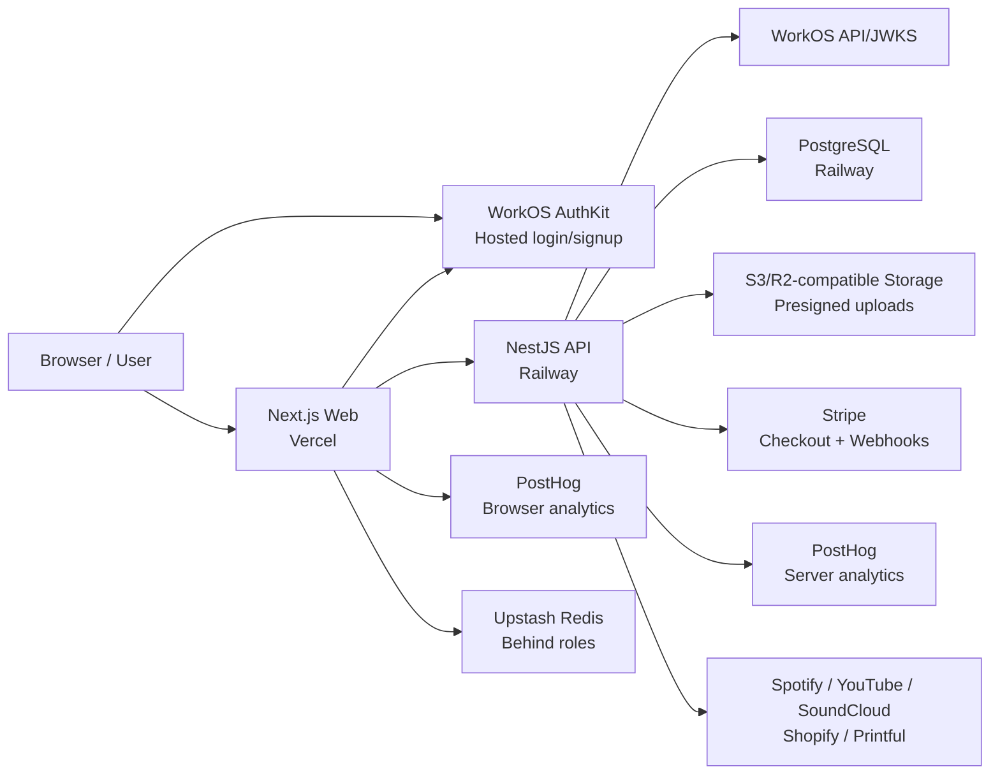
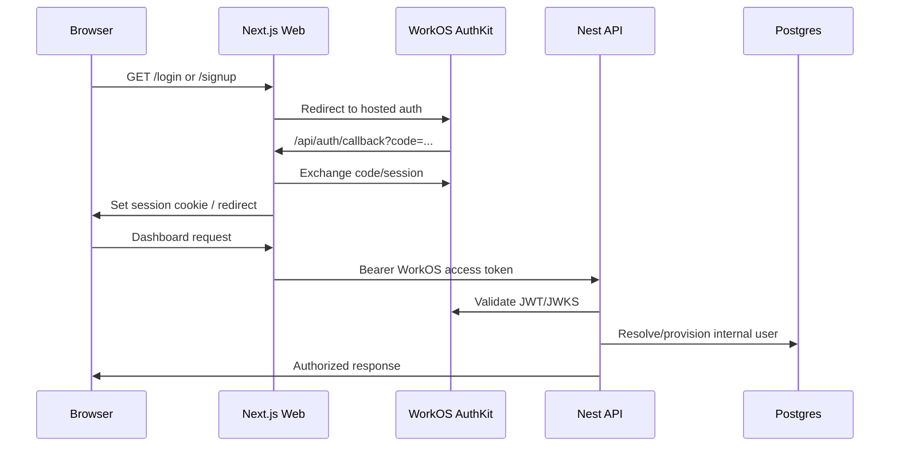
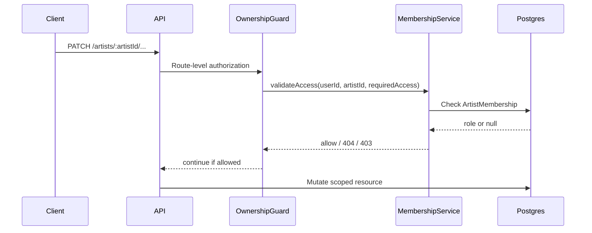
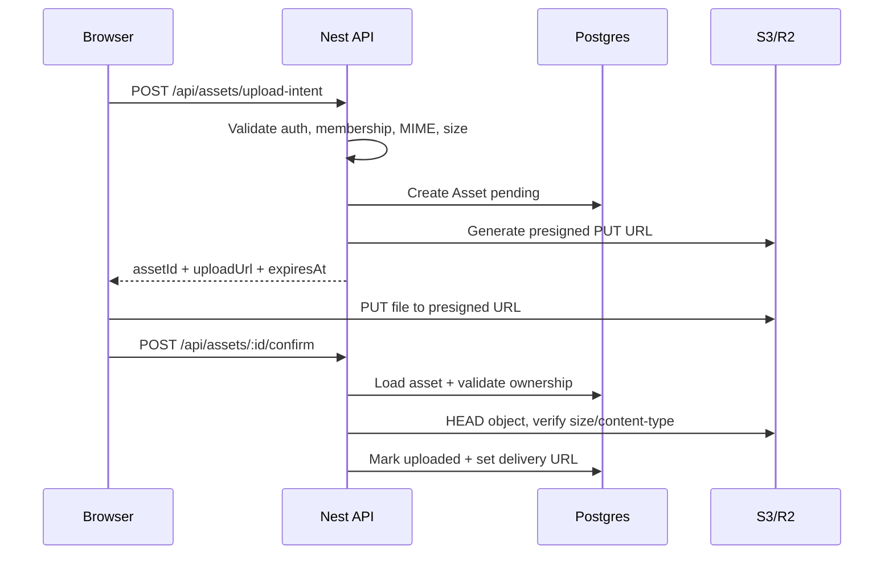
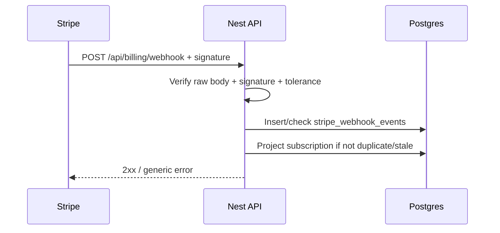
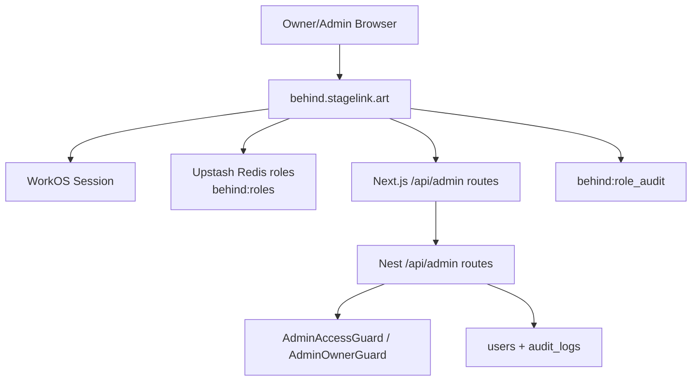

# StageLink - Security Audit E6: Security Architecture

Fecha: 2026-05-13

Estado: arquitectura de seguridad baseline.

## Vista general

## Security boundaries

### Browser

El browser puede:

- iniciar auth en WorkOS AuthKit;
- consumir la web app;
- usar URLs presignadas para subir archivos a storage;
- enviar eventos publicos permitidos.

El browser no debe recibir:

- credenciales WorkOS/Stripe/AWS/R2;
- object keys internos como autoridad;
- provider tokens;
- secretos de API;
- datos privados de otros artistas.

### Vercel Web

Responsabilidades:

- routing publico, auth-gated dashboard y Behind host;
- WorkOS session handling via AuthKit;
- BFF/proxy route handlers para flujos sensibles;
- public SSR de artist pages/EPK;
- PostHog browser analytics segun consentimiento;
- Behind role checks en web edge.

Controles:

- middleware de auth;
- safe redirects/return paths;
- no secrets server-only en `NEXT_PUBLIC_*`;
- host-based Behind routing;
- rate limit web para SmartLink redirect;
- CSP/headers definidos por `next.config.ts`/Vercel.

### Railway API

Responsabilidades:

- validacion JWT WorkOS;
- provisioning de usuarios;
- ownership/membership;
- business logic;
- audit logs;
- billing/webhooks;
- upload intent/confirm;
- provider integrations;
- security event logging.

Controles:

- `JwtAuthGuard` global;
- `@Public()` solo para rutas deliberadamente publicas;
- `OwnershipGuard` y `MembershipService`;
- `ValidationPipe` global;
- `HttpExceptionFilter`;
- `RequestIdMiddleware`;
- `PublicRateLimitGuard` y `UploadRateLimitGuard`;
- `AuditService`;
- logs `security_event=...`;
- raw-body Stripe webhook verification.

### Database

PostgreSQL contiene:

- users;
- artists;
- memberships;
- pages/blocks/EPK;
- assets metadata;
- billing/subscription state;
- subscribers;
- analytics events;
- audit logs;
- encrypted provider tokens.

Controles:

- app-level tenancy por membership;
- encrypted sensitive provider tokens via `SECRETS_ENCRYPTION_KEY`;
- audit logs para mutaciones sensibles;
- idempotency table para Stripe webhooks;
- no RLS actualmente.

Decision:

- DB RLS queda fuera de MVP, como backlog futuro si StageLink escala a mayor
  multi-tenant/compliance.

### Storage

Storage S3/R2-compatible contiene media artistica publica.

Controles:

- presigned PUT URL de corta duracion;
- object key generado server-side;
- MIME allowlist;
- size min/max por asset kind;
- `HEAD` verification antes de confirmar upload;
- bucket publico aceptado solo para assets publicos.

No usar este pipeline para:

- documentos privados;
- contratos;
- IDs personales;
- assets que requieran privacidad o acceso expirable.

### WorkOS

WorkOS controla:

- hosted login/signup;
- Google, Email + Password, Magic Auth;
- recovery flows;
- Radar bot/brute force;
- session and JWT issuance.

StageLink controla:

- redirect/callback config;
- safe return targets;
- API JWT validation;
- internal user status checks;
- Behind allowlist/roles.

### Stripe

Stripe controla:

- checkout;
- portal;
- subscription lifecycle events.

StageLink controla:

- return URL allowlist;
- webhook signature verification;
- idempotency;
- stale event handling;
- subscription projection in DB.

## Auth flow

Key controls:

- WorkOS owns credentials.
- Callback errors redirect safely.
- API validates JWT signature, issuer and claim shape.
- Suspended/deleted internal users are blocked.

## Tenant authorization flow

Key controls:

- artist tenant is server-resolved;
- resources by `pageId`, `blockId`, `smartLinkId` resolve to parent artist;
- no client-controlled tenant authority;
- missing membership hides existence where appropriate.

## Upload flow

Key controls:

- browser never receives storage credentials;
- object key is server-owned;
- confirm is not trusted until storage HEAD succeeds;
- upload intent is rate limited.

## Webhook flow

Key controls:

- no DB write before signature verification;
- idempotency by `stripe_event_id`;
- stale event ordering protection;
- generic errors externally.

## Admin / Behind architecture

Role model:

| Role  | Source                         | Capability                                |
| ----- | ------------------------------ | ----------------------------------------- |
| owner | `BEHIND_ADMIN_EMAILS` or Redis | full access, user mutations, role changes |
| admin | Redis                          | read-only Behind access                   |
| none  | no role                        | no Behind access                          |

## Monitoring architecture

Sources:

- Railway API logs with `security_event=...`;
- Vercel route/deploy logs;
- WorkOS Radar detections;
- DB `audit_logs`;
- DB `stripe_webhook_events`;
- Redis `behind:role_audit`;
- GitHub Actions CI/security audit.

Minimum event names:

- `security_event=http.error`
- `security_event=http.client_error`
- `security_event=rate_limit.exceeded`
- `asset.upload.intent`
- `asset.upload.confirm`
- `admin.*`

## Architecture decisions

| Decision                                     | Status   | Rationale                                                                        |
| -------------------------------------------- | -------- | -------------------------------------------------------------------------------- |
| WorkOS owns credential auth                  | Accepted | Avoids app-owned passwords/reset tokens.                                         |
| App-level tenancy instead of DB RLS          | Accepted | Sufficient for MVP; RLS deferred for future compliance.                          |
| Public bucket for artist media               | Accepted | Product requires public artist imagery; private assets need a separate pipeline. |
| In-memory rate limits for MVP                | Accepted | Fine for low traffic; shared store required before scale.                        |
| Admin role data partly in Redis              | Accepted | Fast Behind role management; env owners preserve bootstrap recovery.             |
| Logs structured but no external alerting yet | Accepted | Runbooks exist; automatic alerts deferred to launch hardening.                   |

## References

- `docs/security-audit-e1-discovery.md`
- `docs/security-audit-e2-authorization.md`
- `docs/security-audit-e2-workos-authkit-config.md`
- `docs/security-audit-e2-admin-behind-security.md`
- `docs/security-audit-e2-file-upload-asset-security.md`
- `docs/security-audit-e2-webhooks-security.md`
- `docs/security-audit-e2-security-monitoring-incident-readiness.md`
